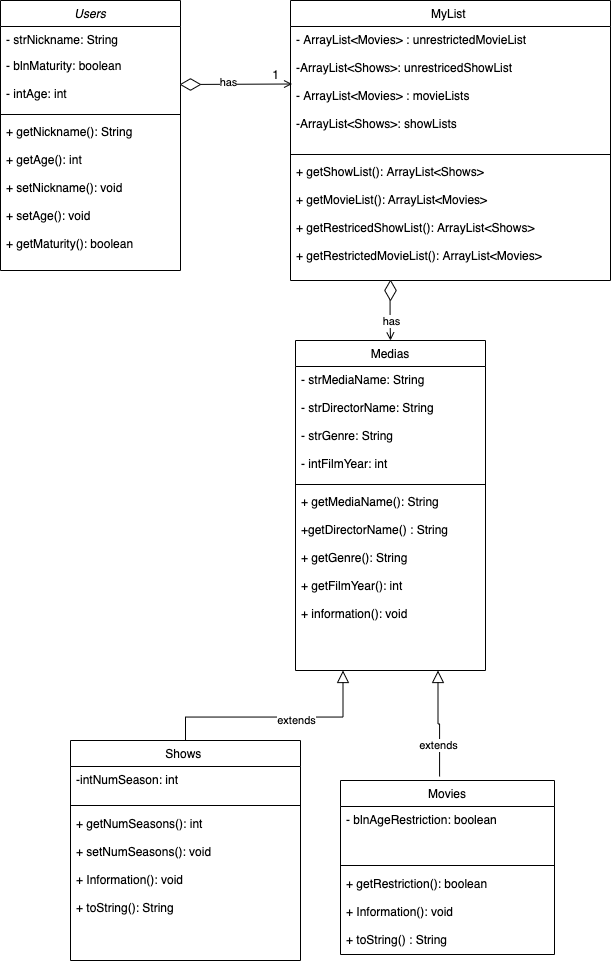

# ICS4U OOP Assignment

[*see instructions for details*](Instructions.md)

*Insert Class Diagram here*  

## Summary
This system models a very basic netflix recommnedation list. The user types in their nickname and age to determine if they are eligible to view age restricted content or not. Then the system prints out a list of movies and shows. Then the user is prompted to select a genre that they like and the program outputs a similar genre show for the user. The user is able to choose if they want to restart this process or logoff. Restarting the process asks them for a new nickname and age. 

